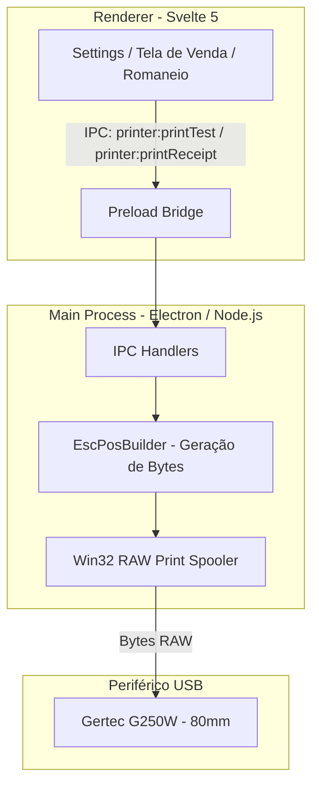

# Especificação Técnica — Impressão Térmica ESC/POS (80mm)

Documentação de integração da impressora térmica não fiscal **Gertec G250W** (80mm) e padrão de comunicação binária ESC/POS para o **Razai Sistema**.

---

## 1. Visão Geral do Hardware

| Parâmetro | Especificação |
| :--- | :--- |
| **Modelo Homologado** | Gertec G250W (ou compatíveis ESC/POS de 80mm) |
| **Largura da Bobina** | 80 mm (Área útil de impressão: ~72 mm) |
| **Resolução** | 203 DPI (8 dots/mm — 576 pontos por linha horizontal) |
| **Capacidade de Colunas** | **48 colunas** na Fonte A (12×24 dots) / 64 colunas na Fonte B (9×17 dots) |
| **Conexão** | USB (Porta de Spooler do Windows, ex.: `USB004`) / Ethernet / Wi-Fi |
| **Guilhotina (Cutter)** | Corte automático parcial e total |
| **Acionamento de Gaveta** | Pulso RJ11 de 24V |

---

## 2. Padrão Arquitetural de Comunicação

Adotamos a **comunicação binária direta ESC/POS RAW via Windows Spooler**:



### Por que RAW ESC/POS em vez de HTML Print?
1. **Velocidade Instantânea**: O buffer é despachado diretamente para a memória da impressora em < 10ms (sem renderização gráfica ou carga de DOM pelo Chromium).
2. **Corte e Gaveta Nativos**: Execução imediata e sem falhas do corte de papel e abertura de gaveta via comandos de hardware.
3. **Imutabilidade Visual**: Alinhamento milimétrico de 48 colunas garantido em qualquer máquina sem dependência de zoom ou escala de página do Windows.

---

## 3. Tabela de Comandos ESC/POS Homologados

| Operação | Hexadecimal | Comando | Descrição |
| :--- | :--- | :--- | :--- |
| **Reset / Inicialização** | `1B 40` | `ESC @` | Restaura as configurações padrão da impressora |
| **Tabela de Código (Charset)**| `1B 74 02` | `ESC t 2` | Seleciona `CP850` (Multilingual Latin I — acentos PT-BR) |
| **Alinhamento à Esquerda** | `1B 61 00` | `ESC a 0` | Alinha o texto à margem esquerda |
| **Alinhamento Centralizado** | `1B 61 01` | `ESC a 1` | Centraliza o texto na bobina |
| **Alinhamento à Direita** | `1B 61 02` | `ESC a 2` | Alinha o texto à margem direita |
| **Negrito Ligar / Desligar** | `1B 45 [01/00]` | `ESC E n` | `01` = Ativa negrito; `00` = Desativa |
| **Modo Invertido (Preto/Branco)**| `1D 42 [01/00]`| `GS B n` | Inverte a cor (fundo preto com texto branco) |
| **Tamanho da Fonte** | `1D 21 n` | `GS ! n` | Multiplica largura/altura (`0x00` normal, `0x11` duplo, `0x22` triplo) |
| **Avanço de Linhas** | `1B 64 n` | `ESC d n` | Avança `n` linhas de papel em branco |
| **Quebra de Linha simples** | `0A` | `LF` | Imprime a linha do buffer e salta uma linha |
| **Corte de Papel (Guilhotina)**| `1D 56 42 00` | `GS V 66 0` | Avança o papel até a lâmina e executa o corte |
| **Acionamento de Gaveta** | `1B 70 00 19 FA` | `ESC p 0 25 250`| Emite pulso no conector RJ11 para abrir gaveta |
| **Código de Barras Code 128** | `1D 6B 49 [len] [data]` | `GS k 73` | Imprime código de barras Code 128 (SKU de tecidos/peças) |
| **QR Code Nativo** | `1D 28 6B ...` | `GS ( k` | Configura e imprime QR Code diretamente no hardware |

---

## 4. Grid de 80mm e Distribuição de Colunas

O papel de 80mm possui **48 colunas** na fonte padrão. Para manter a estética **Industrial Brutalist Grid**, os dados são estruturados em grids de texto rígidos:

### 4.1. Tabela de 4 Colunas (Romaneio / Venda de Tecidos)
```text
[------------------ 48 colunas ------------------]
ITEM / DESCRICAO      QTD        UNIT       TOTAL
------------------------------------------------
LINHO PURO CRU        10m       45,00      450,00
VISCOSE TWILL         25m       28,50      712,50
SARJA 100% ALGODAO     5m       38,00      190,00
------------------------------------------------
```
- **Coluna 1 (Descrição)**: 18 caracteres (alinhado à esquerda)
- **Coluna 2 (Quantidade)**: 6 caracteres (alinhado à direita)
- **Coluna 3 (Valor Unitário)**: 10 caracteres (alinhado à direita)
- **Coluna 4 (Total)**: 11 caracteres (alinhado à direita)
- **Espaçamento**: 3 espaços separadores = `18 + 1 + 6 + 1 + 10 + 1 + 11 = 48 colunas`.

### 4.2. Dois Blocos Justificados (Totais e Metadados)
```text
DATA/HORA:                   19/08/2026 14:30:00
SUBTOTAL:                            R$ 1.352,50
TOTAL:                               R$ 1.300,00
```
- A chave fica alinhada à esquerda e o valor à direita, preenchendo automaticamente o espaço central com espaços em branco (`padEnd`/`padStart`).

---

## 5. Ideias e Aplicações Futuras para o Domínio Têxtil

Quando avançarmos na impressão de documentos operacionais e têxteis, os seguintes formatos já estão preparados na arquitetura ESC/POS:

### 5.1. Etiqueta / Romaneio de Rolo de Tecido (Ficha Técnica)
- **Cabeçalho Industrial**: Código do Tecido (ex: `TEC-001`) em tamanho duplo invertido (`GS B 1` / `GS ! 17`).
- **Composição e Gramatura**: Largura útil (ex: `1.45m`), Rendimento (`3.20 m/kg`), Gramatura (`180 g/m²`).
- **Paleta de Cores Vinculadas**: Lista de cores associadas com Códigos Hex / LAB e SKUs.
- **Código de Barras / QR Code**:
  - Código de Barras **Code 128** com o SKU do rolo para leitura rápida por leitor óptico USB.
  - QR Code para consulta instantânea da ficha técnica no sistema.

### 5.2. Ordem de Corte e Separação
- Lista sequencial de cortes por metro/quilo.
- Linhas tracejadas de conferência física (check-box impresso `[ ]`).
- Assinatura do operador e carimbo de data/hora.

### 5.3. Recibo de Venda / Saída de Estoque
- Identificação do cliente e vendedor.
- Listagem detalhada de itens com metragem e valor total.
- Formas de pagamento (PIX, Cartão, Boleto, Dinheiro) e troco.
- QR Code do PIX ou link de rastreamento de entrega.

---

## 6. Arquivos do Módulo

| Arquivo | Função |
| :--- | :--- |
| `src/main/services/printer/escpos.builder.ts` | Builder fluente em TypeScript para montagem do buffer ESC/POS |
| `src/main/services/printer/raw-print.ps1` | Script Win32 Spooler para envio RAW via `winspool.drv` |
| `src/main/services/printer/printer.service.ts` | Serviço backend: listagem de impressoras e envio de buffers |
| `src/main/ipc/handlers.ts` | Handlers IPC (`printer:list`, `printer:printTest`) |
| `src/preload/index.ts` | Bridge seguro do preload (`window.razai.printer`) |
| `src/renderer/features/settings/components/PrinterSettings.svelte` | Painel de controle e seleção da impressora padrão em Settings |
| `src/shared/types.ts` | Tipagens compartilhadas (`PrinterInfo`, `PrinterApi`, `RazaiApi`) |
