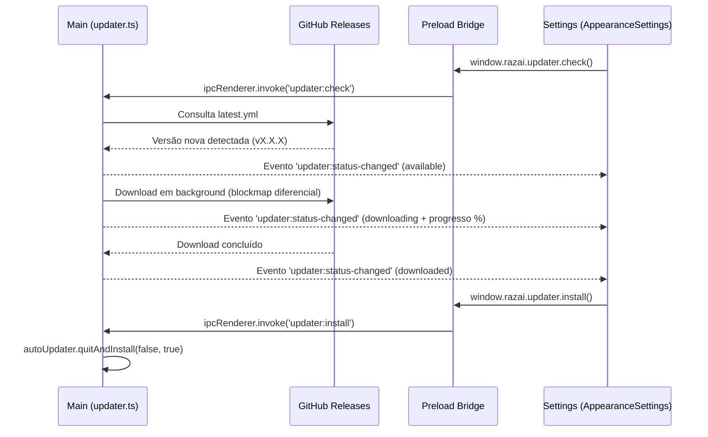

# Packaging, Distribuição e Autoupdate — Razai Sistema

Este documento descreve a arquitetura de empacotamento, distribuição Windows e atualização automática do **Razai Sistema**.

---

## 1. Stack e Ferramentas de Packaging

- **Electron Builder**: `electron-builder` (v26+) configurado via `electron-builder.yml`.
- **Compilação de Binários Nativos C#**: .NET 8 AOT/SingleFile (`dotnet publish` para `resources/bin/WindowsShare.exe`).
- **Bundle de Aplicação**: `electron-vite` gerando código em `out/main`, `out/preload` e `out/renderer`.
- **Mecanismo de Autoupdate**: `electron-updater` consumindo metadados (`latest.yml`), instaladores diferenciais (`.blockmap`) e executáveis das Releases oficiais do GitHub (`xrazai/razai-sistema`).

---

## 2. Configuração do `electron-builder.yml`

```yaml
appId: com.razai.sistema
productName: Razai Sistema
copyright: Copyright © 2026 Razai

publish:
  provider: github
  owner: xrazai
  repo: razai-sistema

directories:
  output: dist
  buildResources: resources

files:
  - out/**/*
  - package.json

asar: true
asarUnpack:
  - "**/*.node"

extraResources:
  - from: resources/bin
    to: bin
    filter:
      - "**/*"

win:
  executableName: Razai Sistema
  target:
    - target: nsis
      arch:
        - x64
    - target: portable
      arch:
        - x64
  artifactName: "Razai-Sistema-Setup-${version}-${arch}.${ext}"

nsis:
  oneClick: false
  perMachine: false
  allowToChangeInstallationDirectory: true
  deleteAppDataOnUninstall: false
  createDesktopShortcut: always
  createStartMenuShortcut: true
  shortcutName: Razai Sistema
  uninstallDisplayName: "${productName} ${version}"

portable:
  artifactName: "Razai-Sistema-Portable-${version}.${ext}"
```

### ⚠️ Regra Crítica de Nomenclatura de Artefatos (`artifactName`)
> **NUNCA use espaços em `artifactName`**:
> O GitHub Releases converte espaços em pontos (`Razai.Sistema-...`), enquanto o arquivo `latest.yml` gerado pelo `electron-builder` aponta para nomes com hífen (`Razai-Sistema-...`).
> Se houver divergência, o `electron-updater` receberá **HTTP 404** ao tentar baixar a atualização.
> O `artifactName` deve ser fixado como `Razai-Sistema-Setup-${version}-${arch}.${ext}`.

---

## 3. Integração de Autoupdate (`electron-updater`)

### 3.1 Interop CJS / ESM no Main Process
Como o projeto utiliza ES Modules nativos (`"type": "module"`), o import do `electron-updater` deve ser resiliente para resolver os getters dinâmicos de CommonJS sem quebrar a inicialização:

```ts
import electronUpdaterPkg from 'electron-updater'

const autoUpdater =
  (electronUpdaterPkg as any)?.autoUpdater ||
  (electronUpdaterPkg as any)?.default?.autoUpdater ||
  electronUpdaterPkg
```

### 3.2 Fluxo de Eventos e Comunicação IPC



---

## 4. Comandos de Build de Produção

| Comando | Descrição |
|---|---|
| `npm run build` | Compila o C# nativo (`WindowsShare.exe`) e empacota bundles Vite (Main, Preload, Renderer) |
| `npm run build:win` | Executa o build completo e gera os instaladores NSIS, Portable e `latest.yml` na pasta `dist/` |
| `npm run package:win` | Gera a pasta desempacotada (`dist/win-unpacked`) para teste local rápido sem criar instalador |
