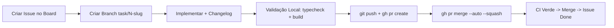
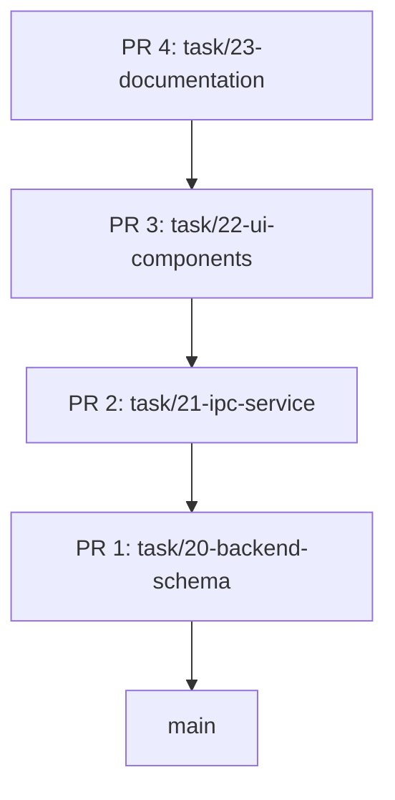

# Guia Definitivo do Workflow de Desenvolvimento no GitHub

Este documento serve como referência técnica completa para reproduzir e executar o fluxo de trabalho de desenvolvimento, integração contínua (CI), gerenciamento de tarefas e Stacked PRs utilizado no **razai-sistema**.

---

## 1. Princípios e Filosofia

- **`main` sempre estável**: Toda alteração entra na `main` via Pull Request após validação local e aprovação dos checks de CI.
- **Desenvolvimento local rápido**: Feedback imediato durante a edição (`typecheck` e `build`).
- **Board do GitHub como única fonte de verdade**: Não usar ferramentas paralelas (Notion, Trello, markdown local); tudo é rastreado no GitHub Projects.
- **Mudanças atômicas e rastreáveis**: Cada issue representa uma unidade de entrega com PR associado.
- **Documentação embutida**: O `CHANGELOG.md` e a documentação técnica são atualizados no próprio PR da feature, evitando PRs isolados de overhead.

---

## 2. Pré-requisitos e Setup Inicial da Máquina

### 2.1 Ferramentas Necessárias

1. **Git** (versão recente com suporte a `rerere`):
   ```powershell
   git --version
   git config --global rerere.enabled true
   ```

2. **GitHub CLI (`gh`)** (versão ≥ 2.90):
   ```powershell
   gh --version
   gh auth login
   ```

3. **Extensão `gh-stack` (GitHub Stacks CLI)**:
   ```powershell
   gh extension install github/gh-stack
   ```

---

## 3. Configuração do Repositório GitHub (Executado 1x por Projeto)

### 3.1 Habilitar Auto-Merge no Repositório
Habilita a possibilidade de PRs serem automaticamente mergeados quando os checks passarem:
```powershell
gh repo edit --enable-auto-merge --enable-squash-merge --delete-branch-on-merge
```

### 3.2 Configurar GitHub Actions CI (`.github/workflows/ci.yml`)
> **Regra Fundamental**: O gatilho `pull_request` **NÃO** deve conter filtro de branches (como `branches: [main]`), permitindo que branches intermediárias em uma cadeia de Stacked PRs disparem os checks de validação.

Arquivo: `.github/workflows/ci.yml`
```yaml
name: CI

on:
  pull_request:
  push:
    branches: [main]

jobs:
  validate:
    name: Typecheck & Lint
    runs-on: ubuntu-latest
    steps:
      - name: Checkout repository
        uses: actions/checkout@v4

      - name: Setup Node.js 22
        uses: actions/setup-node@v4
        with:
          node-version: 22
          cache: 'npm'

      - name: Install dependencies
        run: npm ci

      - name: Run Typecheck
        run: npm run typecheck
```

### 3.3 Regras de Proteção de Branch (Branch Ruleset)
No GitHub (`Settings -> Rules -> Rulesets`):
1. **Target branches**: `Include default branch` (`main`).
2. **Restrict deletions**: Ativado.
3. **Require a pull request before merging**:
   - Required approvals: `0` (para solo developer / automação ágil).
   - Dismiss stale pull request approvals when new commits are pushed: Ativado.
4. **Require status checks to pass before merging**:
   - Require branches to be up to date before merging: Ativado.
   - Status check obrigatório: `Typecheck & Lint` (nome do job do CI).
5. **Block force pushes**: Ativado na `main`.

### 3.4 GitHub Projects (Kanban Board)
Configurar as seguintes colunas/campos no board do projeto:
- **Status (Single Select)**:
  - `Backlog`
  - `Ready`
  - `In progress`
  - `In review`
  - `Done`
- **Priority (Single Select)**:
  - `P0` (Score ≥ 12) — Bloqueios fundamentais / risco alto
  - `P1` (Score 7–11) — Features de produto e robustez
  - `P2` (Score ≤ 6) — Ajustes finos, documentação e cosmética
  - **Fórmula de Priorização**: `score = 3 × desbloqueio + 2 × risco + valor`

---

## 4. Fluxo A: Tarefa Isolada (PR Normal)

Utilizado para tarefas autocontidas e independentes.



### Passo a Passo:

1. **Cadastrar e mover para `In progress`**:
   ```powershell
   # Criar a issue
   gh issue create --title "Task <N> — <resumo>" --body "**Prioridade:** P1 ... **Fluxo:** 1 task = 1 branch"
   
   # Adicionar ao board do projeto (ex: Project 6)
   gh project item-add 6 --owner <owner> --url <issue-url>
   ```

2. **Criar a branch a partir da `main` atualizada**:
   ```powershell
   git checkout main
   git pull --rebase origin main
   git checkout -b task/<N>-<slug-kebab>
   ```

3. **Desenvolver e Atualizar `CHANGELOG.md`**:
   - Implementar o código da tarefa.
   - Se gerou UI genérica: adicionar/atualizar em `DesignSystemPage.svelte`.
   - Adicionar uma linha no topo do `CHANGELOG.md`:
     ```markdown
     ## YYYY-MM-DD — Resumo curto da entrega (Task N)
     ```

4. **Validação Local Obrigatória**:
   ```powershell
   npm run typecheck
   npm run build
   ```

5. **Commit Atômico**:
   ```powershell
   git add .
   git commit -m "Verbo no imperativo resumindo a alteração"
   ```

6. **Submissão e Auto-Merge**:
   ```powershell
   git push -u origin HEAD
   gh pr create --title "feat: <resumo>" --body "Closes #<issue-number>" --base main
   gh pr merge --auto --squash --delete-branch
   ```

7. **Finalização**:
   - Quando o CI passar, o GitHub fará o squash merge e apagará a branch remota automaticamente.
   - Sincronizar o ambiente local:
     ```powershell
     git checkout main
     git pull --rebase origin main
     ```

---

## 5. Fluxo B: Tarefas Encadeadas / Stacked PRs (`gh stack`)

Utilizado quando há dependência direta entre várias tarefas em desenvolvimento (ex: Backend → Serviço IPC → Componentes UI → Ajustes).



### Passo a Passo:

1. **Desenvolvimento Encadeado Local**:
   ```powershell
   # Camada 1
   git checkout main
   git checkout -b task/20-backend-schema
   # [Implementa Task 20]
   git commit -m "Add backend schema and migrations"

   # Camada 2 (a partir da anterior)
   git checkout -b task/21-ipc-service
   # [Implementa Task 21]
   git commit -m "Implement IPC service handlers"

   # Camada 3 (a partir da anterior)
   git checkout -b task/22-ui-components
   # [Implementa Task 22 + Changelog]
   git commit -m "Connect UI components to IPC"
   ```

2. **Inicializar a Stack Localmente**:
   ```powershell
   gh stack init task/20-backend-schema task/21-ipc-service task/22-ui-components
   ```

3. **Validação Completa a partir do Topo da Stack**:
   ```powershell
   # Na branch mais recente (topo)
   npm run typecheck
   npm run build
   ```

4. **Submeter a Stack para o GitHub (Não-Interativo)**:
   ```powershell
   gh stack submit --auto --open
   ```
   *O `gh stack submit --auto --open` faz o push de todas as branches, cria os PRs encadeados com base na branch anterior e marca todos como prontos para review.*

5. **Propagação de Correções (Se precisar alterar uma camada intermediária)**:
   ```powershell
   # 1. Navegar até a branch que precisa de correção
   git checkout task/20-backend-schema
   
   # 2. Fazer os ajustes e commitar
   git commit -am "Fix validation in schema"
   
   # 3. Sincronizar e rebasear todas as camadas superiores automaticamente
   gh stack sync --prune
   
   # 4. Atualizar os PRs no GitHub
   gh stack submit --auto --open
   ```

6. **Merge da Stack Completa**:
   ```powershell
   gh stack merge --yes --squash
   ```
   *O `gh stack merge` realiza o merge bottom-up (de baixo para cima) de forma atômica e limpa as branches remotas e locais.*

7. **Sincronizar a `main`**:
   ```powershell
   git checkout main
   git pull --rebase origin main
   ```

---

## 6. Fluxo C: Execução Sequencial Autônoma de Lotes de Tarefas

Quando for solicitada a execução de um conjunto de tarefas sequenciais da coluna `Ready`:

1. **Criar branches encadeadas** sequencialmente sem interrupção.
2. **Realizar um commit atômico por task** com mensagem no padrão Git.
3. **Executar `typecheck` rápido** entre cada passo.
4. **Incluir a atualização do `CHANGELOG.md`** na task final do lote.
5. **Realizar a validação final completa (`typecheck` + `build`)**.
6. **Aguardar a confirmação do usuário** antes de disparar o push/abertura de PRs.

---

## 7. Tabela de Comandos Frequentes (Cheat Sheet)

| Ação | Comando |
|---|---|
| Adicionar issue ao Board | `gh project item-add 6 --owner <owner> --url <url>` |
| Listar itens do Board | `gh project item-list 6 --owner <owner>` |
| Editar status no Board | `gh project item-edit --id <item-id> --field-id <field-id> --single-select-option-id <option-id> --project-id <project-id>` |
| Inicializar Stack | `gh stack init branch1 branch2 branch3` |
| Adicionar branch na Stack | `gh stack add nova-branch` |
| Submeter Stack pronta | `gh stack submit --auto --open` |
| Sincronizar Stack após rebase | `gh stack sync --prune` |
| Merge atômico de Stack | `gh stack merge --yes --squash` |
| Desfazer tracking de Stack | `gh stack unstack` |
| Acompanhar checks do CI | `gh pr checks <pr-number> --watch` |
| Habilitar auto-merge em PR | `gh pr merge <pr-number> --squash --delete-branch --auto` |

---

## 8. Tratamento de Erros e Armadilhas Comuns

### 1. "Required status check 'Typecheck & Lint' is expected" no `gh stack merge`
- **Causa:** O workflow de CI (`ci.yml`) estava filtrando `branches: [main]` no gatilho `pull_request`, impedindo a execução do check em PRs direcionados a branches intermediárias.
- **Solução:** Manter `on: pull_request` sem filtro de branches no `.github/workflows/ci.yml`.

### 2. PR de documentação desnecessário
- **Causa:** Abrir um PR separado exclusivamente para alterar `CHANGELOG.md` ou documentação.
- **Solução:** O `CHANGELOG.md` deve ser editado e commitado **dentro da branch da própria task**, subindo junto com o PR de código.

### 3. Travar em editores interativos no terminal
- **Causa:** Comandos como `gh stack submit` sem flags abrem um editor TUI interativo.
- **Solução:** Usar sempre `gh stack submit --auto --open` para automação limpa e scripts.
